# Agent Bridge Design

## Status

- Phase: implementation complete; legacy runtime smoke/E2E pending
- Initial scope: legacy React Native Remote Debugger sessions supported by this repository
- Access model: read-only
- Default sensitive-data mode: `redacted`

## Goal

Expose the JavaScript console, Redux DevTools state/actions, and Network Inspect
requests from a running React Native Debugger session to local AI agents through
structured MCP tools.

The bridge must not scrape Chrome DevTools UI state. It should capture the same
underlying events already flowing through the debugger worker and Redux
middleware.

## Non-goals

- Hermes, JSI, or React Native New Architecture debugger support
- Android Logcat, iOS OSLog, or Metro terminal log collection
- Network calls that do not pass through the debugger worker's fetch/XHR layer
- Redux dispatch, state mutation, request replay, or any other write operation
- Remote or LAN access to debug data

## Architecture

```mermaid
flowchart LR
  RN[React Native app] --> Worker[RNDebugger worker]
  Worker --> Capture[Agent event capture]
  Capture --> Renderer[Renderer message router]
  Renderer --> IPC[Electron IPC]
  IPC --> Store[Per-session ring buffers]
  Store --> API[Authenticated loopback API]
  API --> MCP[MCP stdio sidecar]
  MCP --> Agent[Local agent]
```



### Capture points

1. Console and runtime errors are captured in the debugger worker before the
   application bundle is imported.
2. Redux `STATE`, `ACTION`, and related messages are copied from the existing
   Redux DevTools worker-to-renderer message stream after application-provided
   filters and sanitizers have run.
3. Network events are captured around the worker XMLHttpRequest primitive.
   The existing fetch polyfill uses XMLHttpRequest, so fetch and direct XHR
   requests are recorded once.

## Event envelope

Every event sent to the main process uses the following envelope:

```json
{
  "version": 1,
  "sessionId": "opaque-session-id",
  "seq": 42,
  "timestamp": 1785484800000,
  "kind": "console",
  "sensitiveDataMode": "redacted",
  "payload": {}
}
```

Supported `kind` values:

- `session`
- `console`
- `runtime-error`
- `redux-state`
- `redux-action`
- `network-request`
- `network-response`
- `network-error`

Sequence numbers are monotonically increasing inside one session. They are the
pagination and incremental-read cursor exposed to agents.

## Session model

One debugger window and one connected Metro port produce one active session.
Reloading the application or reconnecting creates a new session identifier.

Required session metadata:

- opaque session ID
- Metro host and port
- debugger window ID
- created, connected, disconnected timestamps
- connection status
- sensitive-data mode
- capture capabilities
- last sequence number

Disconnected sessions remain available only in bounded memory until evicted. The
current store retains at most 20 sessions and evicts the least recently active
session when that limit is reached.
No captured events are persisted to disk by default.

## Sensitive-data modes

### `redacted`

This is the default for every new session when no saved mode preference exists.

It redacts:

- authorization, proxy-authorization, cookie, and set-cookie headers
- common credential query keys such as token, access_token, refresh_token,
  password, secret, code, and session
- common sensitive keys in Redux state, actions, JSON request/response bodies,
  and console arguments

Redaction changes values, not keys, so agents can still reason about the shape
of data.

### `raw`

Raw mode allows agents to read original values required for debugging sensitive
flows.

Rules:

- It is enabled explicitly by the user.
- Captured events remain scoped to the current session.
- The user-selected mode is remembered across reload, new JS runtimes, and
  restarts when `persistSensitiveDataMode` is enabled.
- New sessions start in `redacted` when no saved preference exists or when
  `persistSensitiveDataMode` is disabled.
- The debugger UI exposes the current-window control at **Debugger → Allow
  Agent Raw Sensitive Data**; its checked state reflects the focused window's
  active session.
- Every API and MCP response includes `sensitiveDataMode`.
- MCP text output adds a warning when the current mode is `raw`.
- Switching to raw mode does not restore data already captured in redacted
  mode. Only subsequent events are raw.
- Events retain their capture-time mode. A response containing any retained raw
  event is labeled raw even if the current session has returned to redacted.
- The first implementation does not expose an MCP tool for changing the mode.
  Agents cannot enable raw mode themselves.

Recommended config defaults:

```js
agentBridge: {
  enabled: false,
  persistSensitiveDataMode: true,
  maxConsoleEvents: 2000,
  maxReduxActions: 1000,
  maxNetworkRequests: 500,
  maxBodyBytes: 262144,
}
```

`persistSensitiveDataMode` stores only the user's `redacted`/`raw` preference;
it does not persist captured payloads. Raw mode is still enabled only through
the debugger UI, and agents cannot enable it themselves.

## Storage and payload limits

The Electron main process owns bounded per-session ring buffers.

Initial limits:

- console/runtime errors: 2,000 events
- Redux actions: 1,000 events
- Redux state: the latest `STATE`/`INIT` record, refreshed by every `ACTION`
  record that carries the latest state payload
- network requests: 500 requests
- request or response body: 256 KiB

Oversized values include:

- `truncated: true`
- original byte length when known
- retained byte length

Binary bodies return metadata only. Base64 body retrieval is not part of this
release.

## Local transport and authentication

The Electron main process starts the bridge only when `agentBridge.enabled` is
true.

- Bind to `127.0.0.1` only.
- Select an ephemeral port.
- Generate a cryptographically random bearer token at every app start.
- Write discovery metadata to `~/.react-native-debugger/agent-bridge.json`.
- Restrict discovery-file permissions to the current OS user.
- Reject browser-origin requests and do not enable CORS.
- Expose read-only HTTP methods.
- Use constant-time token comparison.

The discovery document contains:

```json
{
  "version": 1,
  "pid": 12345,
  "origin": "http://127.0.0.1:49152",
  "token": "random-secret",
  "startedAt": 1785484800000
}
```

## HTTP API

Initial endpoints:

- `GET /v1/sessions`
- `GET /v1/sessions/:id/logs`
- `GET /v1/sessions/:id/redux/state`
- `GET /v1/sessions/:id/redux/actions`
- `GET /v1/sessions/:id/network`
- `GET /v1/sessions/:id/network/:requestId`
- `GET /v1/sessions/:id/events?after=<seq>&limit=<n>`

List endpoints accept bounded `cursor`, `limit`, and domain-specific filters;
`since` accepts an ISO-8601 timestamp or numeric timestamp. Unknown sessions
return `404`. A cursor older than retained data returns the earliest matching
record available in the bounded buffer.

Token-efficient query options are applied before the response leaves the
bridge:

- logs: `search`, `level`, `compact`, `maxValueBytes`
- Redux state: JSON Pointer `path`, `maxValueBytes`, `maxResultBytes`
- Redux actions: `actionType`, `compact`, `includeState`, `maxValueBytes`
- network lists: `method`, `url`, `status`, `includeHeaders`,
  `includeBodies`, `bodyPreviewBytes`
- network detail: `includeHeaders`, `includeRequestBody`,
  `includeResponseBody`, `bodyPreviewBytes`
- projected results: `maxResultBytes`

Waited `redux-state` events omit state by default. When `includeState=true`,
the same JSON Pointer and value-byte projection is applied before the event
leaves the bridge.

MCP defaults use compact list results, a limit of 20 records, excluded Redux
state snapshots on action reads, network summaries without headers/bodies, and
bounded body previews for individual request details.

## MCP sidecar

The sidecar is a separate stdio process started by the agent host. It discovers
the running RNDebugger instance and translates MCP tool calls into authenticated
loopback API requests.

Initial tools:

- `list_debug_sessions`
- `get_console_logs`
- `get_redux_state`
- `get_redux_actions`
- `get_network_requests`
- `get_network_request`
- `wait_for_debug_event`

The sidecar never stores the bearer token in MCP results or logs.

## Delivery plan

### Phase 1: contracts and pure modules

- Freeze event, session, HTTP, and MCP schemas.
- Implement redaction and truncation helpers.
- Implement per-session ring buffers and cursor pagination.
- Implement the HTTP client used by the sidecar.

### Phase 2: capture

- Install console/error capture before application import.
- Add XHR request/response/error capture without double-counting fetch.
- Copy Redux messages after existing Redux sanitization.
- Route agent events through renderer IPC.

### Phase 3: Electron integration

- Start and stop the bridge with the Electron app lifecycle.
- Create and reset sessions with debugger worker lifecycle.
- Add runtime UI control for `redacted` and `raw`.
- Surface the current mode in the debugger window.

### Phase 4: MCP and verification

- Implement MCP tools and discovery.
- Add unit tests for serialization, redaction, raw mode, ring buffers,
  authentication, and pagination.
- Extend E2E fixtures to emit console, Redux, fetch, and direct XHR events.
- Verify multiple windows and reload isolation.
- Run lint, unit tests, build, and E2E tests.

## Implemented decisions and verification status

- The raw-mode control is the **Debugger → Allow Agent Raw Sensitive Data**
  menu item and follows the focused debugger window.
- Disconnected sessions are retained only in memory, with count-based eviction
  at 20 sessions.
- `get_redux_state` returns the latest state-bearing record. `STATE` and `INIT`
  refresh it; `ACTION` refreshes it and is also retained as an action; protocol
  messages such as `ERROR`, `Error`, and `EXPORT` do not replace it.
- Textual Blob network responses are decoded before capture. Binary network
  payloads expose metadata only; no base64 retrieval endpoint is provided.
- Console search and all token-efficient projections run in the bridge before
  MCP results enter an Agent context.
- Focused automated checks for worker capture, Agent Bridge storage/redaction/
  Redux routing, and the MCP sidecar have passed. A real legacy Remote Debugger
  session still requires manual smoke testing and end-to-end verification.
- Full `yarn test` currently depends on external network fixtures. `yarn
  test-e2e` remains pending while the required 8081 port is occupied.

## Acceptance criteria

1. An agent can list active debugger sessions without opening Chrome DevTools.
2. An agent can incrementally read console entries with stable ordering.
3. An agent can read the current Redux state and recent actions for a selected
   Redux instance.
4. An agent can inspect fetch and direct XHR request/response metadata and
   bounded bodies without duplicate records.
5. Default sessions redact common sensitive values.
6. A user can switch the current session to raw mode from RNDebugger UI.
7. Agents cannot switch to raw mode.
8. Every response reports the current sensitive-data mode.
9. Reload, new JS runtimes, and restart restore the saved mode preference;
   sessions without a saved preference start redacted.
10. The bridge cannot be reached from non-loopback interfaces or without the
    current token.
11. Existing console, Redux DevTools, Network Inspect, and debugger proxy
    behavior remain unchanged when the bridge is disabled.
12. Focused automated checks pass, and a real legacy Remote Debugger session
    completes the manual smoke/E2E validation before release.
